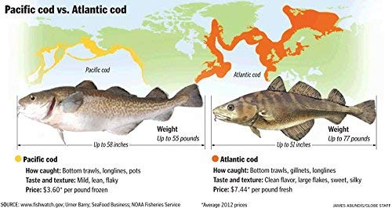
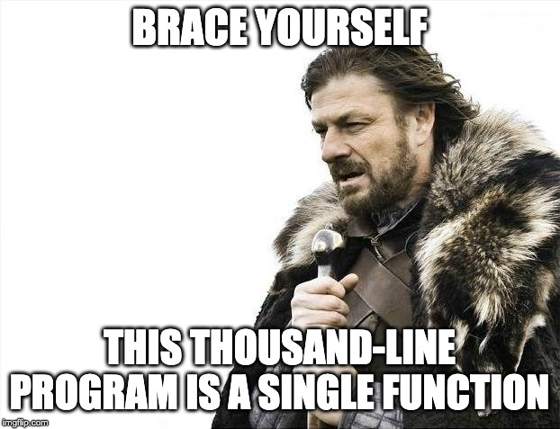
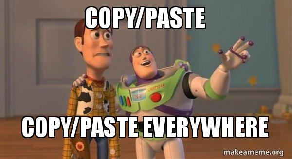
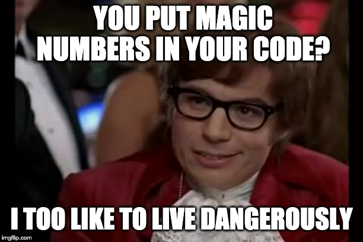
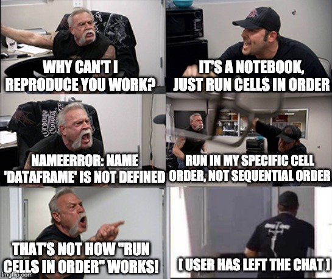
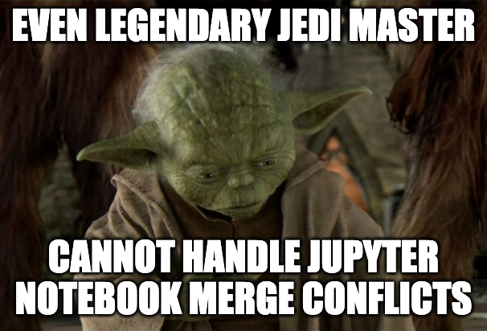
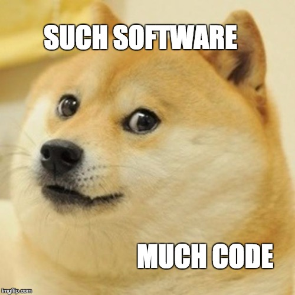
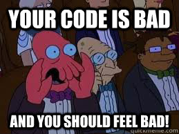

<section class="banner base" date-background="image/title_background.jpg">
    <h2 style="color:white;"; >
    Python Code Quality
    </h2>
    <h2 style="color:white;"; >
    (for data scientists)
    </h2>
    <h5 style="color:white;"; >
    I-Kang Ding
    </h5>
    <h6 style="color:white;"; >
    Feb 2020
    </h6>
</section>

---
### Outline

* <a href="#/introduction">Introduction</a>
* <a href="#/common-code-smell">Common code smell</a>
* <a href="#/python-style-guide">Python style guide</a>
* <a href="#/unit-test">Unit test</a>
* <a href="#/github-collaboration-workflow">GitHub collaboration workflow</a>
* <a href="#/code-review">Code review</a>
* <a href="#/reference">Reference</a>

---
<section id="introduction">
<h2>Introduction</h2>
</section>

---
### `$ whoami`

* Education
  * B.Sc. Chemistry, National Taiwan University
  * M.S. / Ph.D. Materials Sci. Eng., Stanford University

* [Career Path](https://ikding.github.io/resume/)
  * Device engineer at Alta Devices (solar cell startup)
  * Data scientist at a Lumileds (LED manufacturer)
  * Data scientist at Capital One (financial services)
  * Data scientist at KoBold Metals (mineral exploration / climate tech)

---
### What is cod equality?

`assert (pacific_cod == atlantic_cod)`

</img>

---
### What is ~~cod equality~~ code quality?

</img>

Source: [xkcd](https://xkcd.com/844/)

---
### What is ~~cod equality~~ code quality?

<p style="text-align:left;">"All code bases with good code quality look alike. On the other hand, code bases with bad code quality can be bad for a variety of reasons." - Aristotle, probably </p>

</img>


### Code quality 1

</img>

Source: [xkcd](https://xkcd.com/1513/)


### Code quality 2

</img>

Source: [xkcd](https://xkcd.com/1695/)


### Code quality 3

</img>

Source: [xkcd](https://xkcd.com/1833/)

---
### Good code quality

* Are there any obvious logic errors in the code? (**correctness**)
* Looking at the requirements, are all cases fully implemented? (**functionality**)
* Does the code include appropriate documentations, and conform to existing style guidelines? (**readability**)
* Are the code covered by test cases? Do existing tests need to be rewritten to account for changes in code? (**testing**)
* Can the code quality be further improved with good design practices? (**design**)
* Is it easy to build on your code and add new functions? Or reuse your code as a module in other programs? (**extensibility**)
* Can you improve the runtime or disk/memory consumption of your program? (**resource**)

---
### Why should DS care about code quality?

* Code is a form of communicate with machines that does the heavy lifting computation for us.
* Code is a form of communication between people.
* Data science projects (analysis, ML models, etc) are often collaborative in nature - you won't be the only person who needs to use or modify your code

---
### My journey on code quality

* 2015: joined Capital One as primarily an R user
  * Submitted my code challenge in R
  * Only learned Python during interview prep
  * Learned more Python (by doing) through internal training programs and projects
* 2016: got serious about Python code quality
  * Collaborated with a former software engineer at Google on making an internal Python package
  * Got my first PR tore apart (constructively) by my teammate

---
### My journey on code quality (2)

* 2017: improve Python code quality and dabble in DevOps
  * Internal package sees more adoption - need to boost docs (sphinx) and CICD testing (CircleCI)
  * Performing my own DevOps work through awscli, ansible
* 2018-2020: apply my own learning to my new role (model developer)
  * Convert my team's model development code from databricks notebooks into pip-installable package
  * Adopting best practices such as sphinx docs, unit tests, integration tests, functional tests
  * Test driven development (TDD) whenever possible

---
<section id="common-code-smell">
<h2>Common Code Smell</h2>
<h3>(and what to do about it)</h3>
</section>

---
### Code smell: writing long scripts

</img>

---
### Code smell: writing long scripts

* Why we've all done it:
  * Don't want to interrupt the flow
  * Can't imagine reusing any components in the function

* Why it's bad:
  * Impossible to test individual pieces of functionality
  * Hard to read

---
### What you should do instead

* Modularize based on individual units of functionality, with an eye toward separating at "logic break points" (e.g. data acquisition -> data loading -> business logic)
* Use standard data structures at interfaces

---
### Code smell: copypasta hell

</img>

---
### Code smell: copypasta hell

`cmd-c, cmd-v`

```python
import pandas as pd

df = pd.read_csv('../data/file.csv')
df_ny = df[df.state == 'NY']
df_va = df[df.state == 'VA']
df_il = df[df.state == 'IL']
# [... copy one line for each state]
```

---
### Code smell: copypasta hell

* Why we've all done it:
  * Quick and easy
  * Copy from another script
  * Making variations on a theme

* Why it's bad:
  * Hard to maintain and/or modify
  * Easy for code blocks to get out of sync

---
### What you should do instead

* First time you want to copy, wince and do it. The second time, refactor.
* For common tasks (e.g. run SQL query, copy data from local to S3 buckets, etc), look for solutions that already exist.

---
### Code smell: hard-coding file paths

```python
df = pd.read_csv('/Users/eid123/some/path/on/your/machine/very_cool_data.csv')
# [all the 300 lines of code for analyzing this very cool data]
# How do I know it's very cool?
# It said so in the filename, duh
```

---
### Code smell: hard-coding file paths

* Why we've all done it:
  * Quick and easy
  * Robustly figuring out path is a pain

* Why it's bad:
  * Hard to maintain
  * "Oh, to make the code run, you have to set your folder structure this way... What? you are using a Windows machine?"

---
### What you should do instead

* Put things like file names in a configuration module
* Use `os.path` or `pathlib` to determine absolute paths (bonus: this also takes care of platform interoperability)

```python
"""config.py"""
import os

# Get application directory
APPDIR = os.path.dirname(os.path.realpath(__file__))
# Get parent directory
ROOTDIR = os.path.abspath(os.path.join(APPDIR, os.pardir))
# Get data directory
DATADIR = os.path.abspath(os.path.join(ROOTDIR, 'data'))
# Get data file
DATAFILE = os.path.abspath(os.path.join(DATADIR, 'file.csv'))
```

---
### Code smell: using magic numbers

<p style="text-align:left;">Magic numbers: unique values with unexplained meaning or multiple occurrences which could (preferably) be replaced with named constants </p>

```python
import pandas as pd

df = pd.read_csv('../data/file.csv')
df_ny = df.iloc[:3]
df_va = df.iloc[3:6]
df_il = df.iloc[6:9]
```

---
### Code smell: using magic numbers

</img>

---
### Code smell: using magic numbers

* Why we've all done it:
  * Originally taught to program using arrays
  * Coding dynamic lookups is slower and more difficult than referencing index number

* Why it's bad:
  * Impossible to read and verify
  * Reference indices can (and do!) change

---
### Code smell: using magic numbers

"I'll just reuse my old script to load the new data for this month"

<iframe src="https://giphy.com/embed/nLhdSinRtaL2E" width="470" height="480" frameBorder="0" class="giphy-embed" allowFullScreen></iframe>

---
### What you should do instead

* Use data structures that support string labels (e.g. `pd.DataFrame`)
* For constants that you want to reuse, replace magic numbers with named constants or function arg

```python
def calculate_speed_with_gravity(sec):
    """Calculate the speed of object after ``sec`` seconds"""
    return sec * 9.81
```

```python
def calculate_speed_with_gravity_func_arg(sec, gravity_acceleration=9.81):
    """Calculate the speed of object after ``sec`` seconds"""
    return sec * gravity_acceleration
```

```python
GRAVITY_ACCELERATION = 9.81

def calculate_speed_with_gravity_named_const(sec):
    """Calculate the speed of object after ``sec`` seconds"""
    return sec * GRAVITY_ACCELERATION
```

---
### Code smell: no comments or docstrings

<p style="text-align:left;">"Documentation? No, just read the code... it's all pretty straightforward."</p>

<iframe src="https://giphy.com/embed/Myd5rnSXpvpL2" width="480" height="288" frameBorder="0" class="giphy-embed" allowFullScreen></iframe>

Source: [twitter](https://twitter.com/jakevdp/status/847859811823767552)

---
### Code smell: no comments or docstrings

* Why we've all done it:
  * Code functionality is very clear*
    * Only clear to the person who wrote it
    * Only clear at time of writing
  * "Why would I spend time writing docstrings? Nobody else is going to use this"

* Why it's bad:
  * **You** will need to use this

---
### What you should do instead

* Docstring always
* Comment in-line liberally
* Bonus: make html-formatted docs with tools like [sphinx](http://www.sphinx-doc.org/en/master/)

---
### Code smell: lazy exception handling

```python
try:
    important_function_that_should_work()
except:
    pass  # YOLO, LOL
```

---
### Code smell: lazy exception handling

* Why we've all done it:
  * Can't think of other things that could go wrong
  * Too lazy to look up proper exception codes

* Why it's bad:
  * We are willing to catch *any* error, although we are not prepared for it **and** we also don't do anything about it
  * This **will** make your code break silently and in a completely unpredictable way that no one can debug
  * More details in this SO answer: [Why is `except: pass` a bad programming practice?](https://stackoverflow.com/a/21553825)

---
### What you should do instead

* Catch only exceptions you really expect and are prepared to recover from (and clearly state it in docstrings)
* All other exceptions are likely either mistakes you should fix, or something you are not prepared for anyway (and should not catch)

```python
import sys

try:
    f = open('myfile.txt')
    s = f.readline()
    i = int(s.strip())
except OSError as err:
    print("OS error: {0}".format(err))
except ValueError:
    print("Could not convert data to an integer.")
except:
    print("Unexpected error:", sys.exc_info()[0])
    raise
```

---
### Code smell: Do everything in notebooks

* Notebooks are typically web applications that marries code, graphics, markdown text, and more, in an bid to create "literate programming" environment.
* Examples include: Jupyter (Python), Databricks (Spark), R Markdown / knitr (R)

---
### Code smell: Do everything in notebooks

</img>

---
### "Let's collaborate on a code base in notebooks!"

</img>

---
### What notebooks are good for

* Great for exploratory work or just "playing around"
* Fantastic for making it easy to publish final result with co-located code, plots, and write-ups
* Useful for tutorials-type environments

---
### What notebooks are *not* good for

* Get in the way of learning solid programming skills and encourage bad coding practices
  * Hard to modularize and test components
  * Does not play well with tools for code quality checks and unit test suites
* Get in the way of reproducibility
  * Very easy for cells to be run out of order
  * ... and no ways for others verify
* Make collaboration much harder
  * Jupyter notebook (`.ipynb`) are a mish-mash of json, html, python, and markdown (and potentially more)
  * GitHub merge conflicts can be full of pain and suffering

---
### What you should do instead

* Only use notebooks for what they are good for
* The moment that you realized your notebook may be reused by others, or morph into a more persistent, long-term project - refactor code into a a proper Python script (or package)!

---
<section id="python-style-guide">
<h2>Python style guidelines</h2>
</section>

---
### Code style guidelines

* If code standards are the wheels of collaboration, style standards are the grease.
* You should know the style guidelines for your primary programming language, but having a single, agreed-upon standard is more important than knowing specific guidelines.

---
### PEP8

* PEP = Python enhancement proposal
* [PEP8](https://www.python.org/dev/peps/pep-0008/) is one of the wildly used style guide for Python code
* It is well-supported by many code linters

</img>

---
### Google Python style guide

* [Google Python style guide](http://google.github.io/styleguide/pyguide.html) is superset of PEP8, with its own idiosyncrasies

---
### Naming conventions

| Type                        | Public                      | Internal              |
|-----------------------------|-----------------------------|-----------------------|
| Files                       | `lower_with_under.py`       |                       |
| Package                     | `lower_with_under`          |                       |
| Modules                     | `lower_with_under`          | `_lower_with_under`   |
| Classes                     | `CapWords`                  | `_CapWords`           |
| Exceptions                  | `CapWords`                  |                       |
| Functions                   | `lower_with_under()`        | `_lower_with_under()` |
| Global / Class Constants    | `CAPS_WITH_UNDER`           | `_CAPS_WITH_UNDER`    |

---
### Naming conventions

| Type                        | Public                      | Internal              |
|-----------------------------|-----------------------------|-----------------------|
| Global / Class Variables    | `lower_with_under`          | `_lower_with_under`   |
| Methods                     | `lower_with_under()`        | `lower_with_under()`  |
| Function / Method Parameters| `lower_with_under`          |                       |
| Local Variables             | `lower_with_under`          |                       |

---
### How to choose names

</img>

Source: [xkcd](https://xkcd.com/910/)

---
### How to choose names

* Variables are adjective nouns (`merchant_record`)
* Function are verbs followed by nouns (`get_merchant_record()`)
* Booleans are questions (`is_valid_record`)
* Iterables are pluralized (`for state_name in state_names`)

<p style="text-align:left;">(Personal preference, not specified by PEP8)</p>

---
### Choose descriptive names

<p style="text-align:left;">Names should be as long as they need to be specific and descriptive.</p>

```python
# Not recommended
>>> x = 'John Smith'
>>> y, z = x.split()
>>> print(z, y, sep=', ')
'Smith, John'
```

```python
>>> # Recommended
>>> name = 'John Smith'
>>> first_name, last_name = name.split()
>>> print(last_name, first_name, sep=', ')
'Smith, John'
```

---
### Use abbreviations at your peril

```python
# Not recommended
# What's db? Double? Database? Decibel?
def db(x):
    return x * 2
```

```python
# Recommended
def multiply_by_two(x):
    return x * 2
```

---
### White spaces

<iframe src="https://giphy.com/embed/l0IylSajlbPRFxH8Y" width="480" height="268" frameBorder="0" class="giphy-embed" allowFullScreen></iframe>

---
### White spaces

* Do not mix tab and spaces (seriously, there is a `TabError` error type in Python 3 specifically for this)
* Use 4 consecutive spaces per indentation level
* Set your editor to automatically convert tab to 4 spaces
* Set your editor to automatically remove trailing whitespaces

---
#### No white spaces inside parentheses, brackets or braces

```python
# Good
spam(ham[1], {eggs: 2}, [])
```

```python
# Bad
spam( ham[ 1 ], { eggs: 2 }, [ ] )
```

---
#### Surround binary operators with single space on either side for assignment, comparisons, and booleans

```python
# Good
x == 1
```

```python
# Bad
x==1
```

---
#### Do not use spaces around `=` when passing keyword arguments or defining a default parameter value

```python
# Good
def complex(real, imag=0.0):
    return Magic(r=real, i=imag)
```

```python
# Bad
def complex(real, imag = 0.0):
    return Magic(r = real, i = imag)
```

---
### Blank lines

* Two blank lines between top level definitions (be they function or class definitions)
* One blank line between method definitions
* Single blank lines as appropriate within functions or methods

---
### Docstrings

* A docstring is a string that is the first statement in a package, module, class or function.
* Always use the three double-quote (`"""`) format for docstrings ([PEP-257](https://www.python.org/dev/peps/pep-0257/))
* A docstring should be organized as a summary line, followed by a blank line, followed by the rest of the docstring starting at the same cursor position as the first quote of the first line.
* There are a few docstring conventions that are quite popular, such as [Numpy Style](https://sphinxcontrib-napoleon.readthedocs.io/en/latest/example_numpy.html#example-numpy) or [Google Style](https://sphinxcontrib-napoleon.readthedocs.io/en/latest/example_google.html#example-google).
* Be consistent!

---
### [Google style docstring](https://sphinxcontrib-napoleon.readthedocs.io/en/latest/example_google.html#example-google)

```python
def func(arg1, arg2):
    """Summary line.

    Extended description of function.

    Args:
        arg1 (int): Description of arg1
        arg2 (str): Description of arg2

    Returns:
        bool: Description of return value

    """
    return True
```

---
### [NumPy style docstring](https://sphinxcontrib-napoleon.readthedocs.io/en/latest/example_numpy.html#example-numpy)

```python
def func(arg1, arg2):
    """Summary line.

    Extended description of function.

    Parameters
    ----------
    arg1 : int
        Description of arg1
    arg2 : str
        Description of arg2

    Returns
    -------
    bool
        Description of return value

    """
    return True
```

---
### Inline comments

* Inline comments are useful in tricky parts of the code.
* If you're going to have to explain it in a code review, you should comment it now.
* Complicated operations get a few lines of comments before the operations commence.
* Non-obvious ones get comments at the end of the line (two spaces between code and start of comment character, `#`)

```python
# We use a weighted dictionary search to find out where i is in
# the array.  We extrapolate position based on the largest num
# in the array and the array size and then do binary search to
# get the exact number.

if i & (i-1) == 0:  # True if i is 0 or a power of 2.
```

---
### Tools for code style guides: Linters

* Linters are programs that analyze code and flag errors. They provide suggestions on how to fix the error.
* Linters are particularly useful when installed as extensions to your text editor, as they flag errors and stylistic problems while you write.
* Tools: [`pylint`](https://pypi.org/project/pylint/), [`pycodestyle`](https://pypi.org/project/pycodestyle/), [`flake8`](https://pypi.org/project/flake8/), etc

---
### Tools for code style guides: Autoformatters

* Autoformatters are programs that refactor your code to conform with PEP 8 automatically.
* If you and your collaborators can agree on using the same autoformatter, it can make code review a lot easier
* Tools: [`black`](https://pypi.org/project/black/), [`autopep8`](https://pypi.org/project/autopep8/0.8/), [`yapf`](https://pypi.org/project/yapf/), etc.
* You can try them on an existing code base and which one you like the best!

---
<section id="unit-test">
<h2>Unit Tests</h2>
</section>

---
### Problem: "such software, much code"

* How do you know your shiny new function is working?
* How do you know the refactoring you worked on didn't break anything?
* How do you know your environment didn't change overnight and break your script?

</img>

---
### What are unit tests?

* A test is an extra piece of code to verify the correctness of the code we actually care about
* Unit tests can be designed to check for expected behavior under a variety of test cases
* You can run the tests every time the code changes, to make sure that the whole system still functions as expected

---
### Benefits of unit testing

* Verify present-day correctness
* Establish interfaces & communicate with colleagues (PR reviewers)
* Enable refactoring & reduce maintenance burden
* Guard against complex interactions between other functions
* Force good design

Reference: [Write tests](http://matthewrocklin.com/blog/work/2016/02/08/tests) - Matthew Rocklin

---
### Unit test example

```python
# content of test_sample.py
import pytest

def add_by_one(x):
    return x + 1

def test_add_by_one():
    assert add_by_one(3) == 4

def test_add_by_one_type_error():
    with pytest.raises(TypeError):
        add_by_one('some_string')
```

```
$ pytest pytest_example.py
================================== test session starts ==================================
pytest_example.py ..                                                              [100%]

=============================== 2 passed in 0.05 seconds ================================
```

---
### Unit testing tooling

* [`unittest`](https://docs.python.org/3/library/unittest.html): built-in in Python standard library; inspired by JUnit (JAVA)
* [`pytest`](https://docs.pytest.org/en/latest/): another unit testing framework; less verbose in its implementation
* [`doctest`](https://docs.python.org/3/library/doctest.html): allow you to include examples of usage and unit tests right within documentation
* [`coverage`](https://coverage.readthedocs.io/en/latest/): measuring test coverage of Python code. It can show which parts of your code are being exercised by tests, and which are not.
* Goal:
  * The important thing is to pick a framework (`unittest` or `pytest`) and start writing unit tests!
  * `doctest` and `coverage` are icing on the cake.

---
### Other kinds of tests

* Unit tests: individual functions / classes
* Integration tests: interface with other systems: database, HDFS, S3 buckets, H2O cluster, etc
* Functional tests: end-to-end of entire pipelines
* Golden master tests: outputs generated by a realistic "golden input" do not change as software is updated

---
<section id="github-collaboration-workflow">
<h2>GitHub collaboration workflows</h2>
</section>

---
### What is GitHub?

* Version control your code
* Share code and collaborate with others through [code review](https://github.com/features/code-review/)
* "If I ask someone 'where is your code?', and it's not in GitHub yet, then I start to worry about what else might be wrong."

---
### GitHub isn't just for code!

* [GitHub pages](https://pages.github.com/): a light-weight web hosting platform
* [GitHub issues](https://help.github.com/en/github/managing-your-work-on-github/creating-an-issue): keep track of bugs, enhancements, or other request. Also functions as light-weight [project management tool](https://github.com/features/project-management/)
* [GitHub gist](https://help.github.com/en/github/writing-on-github/creating-gists): instantly share code, notes, and snippets
* Presentations: This slide deck is made with [`reveal.js`](https://revealjs.com) and hosted on GitHub

---
### Why share your code on GitHub?

* Version control
* Force you to write better code
* Enables collaboration
  * "Interesting and unpublished" is equivalent to "non-existent." - George Whitesides on [Writing a paper](https://onlinelibrary.wiley.com/doi/abs/10.1002/adma.200400767)
  * Same principle applies to code!
  * "If you don't share, you're basically useless to everyone else"

---
### Common pushbacks

* "I don't write code"
* "I don't know how to use GitHub"
* "I haven't committed my code to GitHub because it's not ready"
  * If you hear this, there is a high likelihood that the code will never be ready

<p style="text-align:left;">"GitHub is where you put code on to get it done, not where you put code on once it's done."</p>

---
### GitHub collaborative workflows

Source: [Atlassian - Comparing Workflows](https://www.atlassian.com/git/tutorials/comparing-workflows)

* Centralized workflow
* Feature branch workflow
* Gitflow workflow
* Forking workflow

---
### [Centralized workflow](https://www.atlassian.com/git/tutorials/comparing-workflows#centralized-workflow)

* Summary:
  * The default (main) branch is called `master`
  * All commits are made to `master`
  * Merge conflicts needs to be resolved often using `git rebase`
* Great for small teams (or a "long-wolf" programmer)
* The conflict resolution process can form a bottleneck as your team scales in size.

---
### [Feature branch workflow](https://www.atlassian.com/git/tutorials/comparing-workflows/feature-branch-workflow)

* Summary:
  * The default (main) branch is called `master`
  * Developers create `feature` branches where changes are made and tested
  * `feature` are merged back into `master` via PR's which initiate code reviews and discussions
* Organize and track branches that are focused on business domain feature sets
* Promotes collaboration with team members through pull requests and merge reviews

---
### [Gitflow workflow](https://www.atlassian.com/git/tutorials/comparing-workflows/gitflow-workflow)

* Similar to feature branch workflow. Great for a release-based software workflow.
  * The `master` branch serves as the official releases of your project
  * The `develop` branch serves as an integration branch for features
  * Developers create `feature` branch where changes are made and tested
  * `feature` are merged back into `develop` via PR's which initiate code reviews and discussions
  * Once enough `features` have accumulated or time has passed for a new release, a `release` branch is created from `develop`
  * `hotfix` branch are created from `master` when production releases needs to be quickly patched

---
### Gitflow schematics

</img>

---
### [Forking Workflow](https://www.atlassian.com/git/tutorials/comparing-workflows/forking-workflow)

* Summary:
  * Instead of committing directly to the main repo, you fork the code base to your own personal repo.
  * You can combine this with any of the above workflows. The only difference is your PR would come from your "fork", rather than another branch within the main repo.
* Contributions can be integrated without the need for everybody to push to a single central repository
* Provides a flexible way for large, organic teams (including untrusted third-parties) to collaborate securely
* An ideal workflow for open source projects

---
<section id="code-review">
<h2>Code Review</h2>
</section>

---
### Why code reviews?

* Code review is crucial to improve and maintain code quality
* Testing itself is necessary but not sufficient - someone needs to check the coverage and logic of tests
* Code review help catch more bugs, make code easier to maintain, and encourage knowledge sharing

</img>

---
### Code review scope

* Are there any obvious logic errors in the code? (**correctness**)
* Looking at the requirements, are all cases fully implemented? (**functionality**)
* Does the code include appropriate documentations, and conform to existing style guidelines? (**readability**)
* Are the code covered by test cases? Do existing tests need to be rewritten to account for changes in code? (**testing**)
* **Note**: code reviews normally do not cover sutability of the system architecture designs. Such discussions should ideally happen before any code is written.

---
### Code review: PR authors

* Spend some time to get familiar with Python style guide
* Read through your own PR before submitting a PR, and make fixes to the rules in the style guide
* Make sure all unit tests passes (bonus: set up CICD pipelines)
* Aim for bite-sized PRs, not epic, full-novel-length ones
* Clearly describe the work in PR (link relevant issues if needed)
* Tag the primary reviewer in the PR so he/she gets an email notification
* Tag multiple reviewers as necessary (or available)

---
### Code review: PR reviewers

* Check correctness, functionality, testing coverage, style guide rules, and readability, then offer constructive feedback
* Cite rules and explain your reasoning behind each recommendation
* You shouldn't rush through a code review, but you should do it promptly
* GitHub allow you to register your final judgement
  * Yes? Ship it
  * No? Fix it

---
### PR reviewers should be considerate

* Code reviews are essentially critiques - be considerate, and recognize the potential emotional responses of the author
* PR review should result in better quality code, and better programmers
* PR review should not result in bruised egos, lower morales, and increased attrition

</img>

---
### Code reviewer principles

* Always find something to praise
* Ask, don't judge
* Speak in "I would" terms, not "you should"
* Don't criticize someone for asking a question
* Focus on the solution, not the problem
* Remind people that it's about the work, not the person

---
<section id="reference">
<h2>Reference</h2>
</section>

---
* [Best practices for scientific computing](https://journals.plos.org/plosbiology/article?id=10.1371/journal.pbio.1001745)
* [Google Python style guide](http://google.github.io/styleguide/pyguide.html)
* [The different types of software testing](https://www.atlassian.com/continuous-delivery/software-testing/types-of-software-testing) - Atlassian
* [Write tests](http://matthewrocklin.com/blog/work/2016/02/08/tests) - Matthew Rocklin
* ... and lots of discussions with my colleagues at Capital One!
